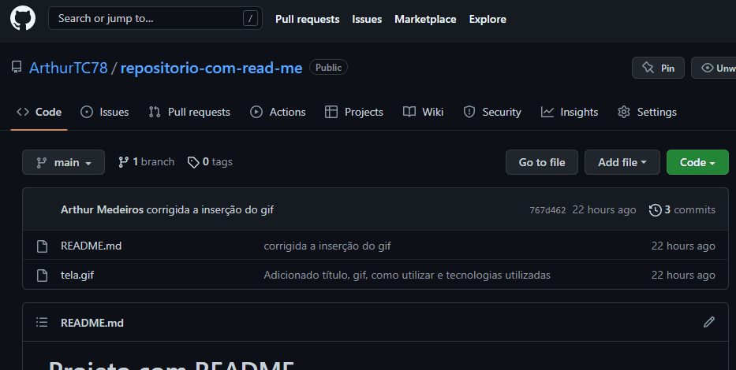

# Projeto com README
Um projeto de teste com um arquivo README 🚀



## Tecnologias utilizadas
- HTML
- CSS

## Como utilizar

1 - Copie a url do repositório do GitHub

2 - Clone para o projeto pelo Git Bash
```
git clone (url)
```

3 - Acessar a pasta do projeto
``` 
cd nome-do-repositorio
```
4 - Abra no VS Code
```
code .
```
